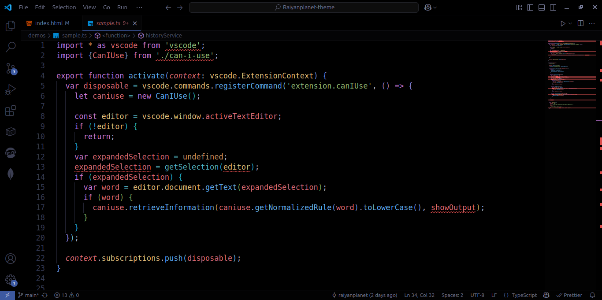
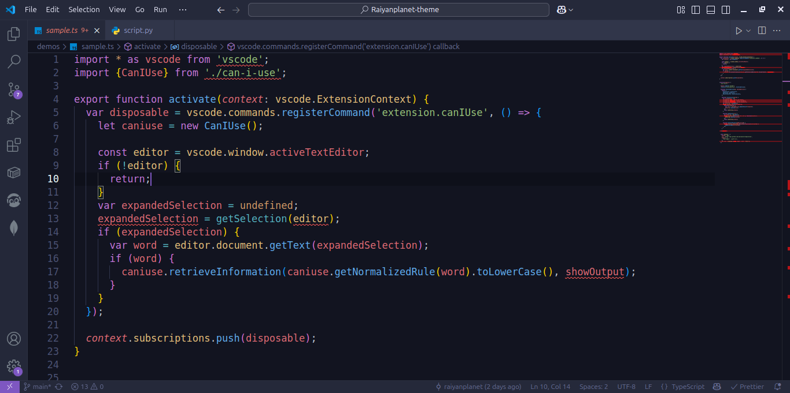

<div align="center" >

</div>

# 🌌 Raiyan Planet Theme

**A stunning collection of dark themes for Visual Studio Code that brings the beauty of the cosmos to your coding experience.**


---

## ✨ Theme Variants

Raiyan Planet comes in three carefully crafted variants, each designed to provide a unique and immersive coding experience:

### 🌑 Raiyan Planet Darkest

The deepest, most immersive dark experience. Perfect for late-night coding sessions with maximum eye comfort and minimal strain.

### Typescript



### Python


### 🌃 Raiyan Planet Dark Knight

A balanced dark theme with subtle highlights. Ideal for developers who want darkness with character and personality.

### Typescript


### Python


### 💜 Raiyan Planet Purple

A cosmic purple experience that adds mystique and elegance to your workspace. For those who love a touch of color in their coding environment.

### Typescript



### Python


---

## 🚀 Installation

### Via VS Code Marketplace

1. Open Visual Studio Code
2. Go to Extensions (`Ctrl+Shift+X` or `Cmd+Shift+X`)
3. Search for "Raiyan Planet Theme"
4. Click **Install**
5. Go to `File > Preferences > Color Theme` (or `Code > Preferences > Color Theme` on macOS)
6. Select your preferred Raiyan Planet variant

### Via Command Palette

1. Press `Ctrl+Shift+P` (or `Cmd+Shift+P` on macOS)
2. Type "Preferences: Color Theme"
3. Select your preferred Raiyan Planet variant

---

## 🎨 Features

- **🌙 Eye-friendly dark themes** - Carefully chosen colors to reduce eye strain
- **🎯 Syntax highlighting** - Optimized for popular languages including JavaScript, TypeScript, Python, HTML, CSS, and more
- **🔥 Modern aesthetics** - Clean, contemporary design that enhances focus
- **⚡ Performance optimized** - Lightweight themes that don't slow down your editor
- **🎪 Three unique variants** - Choose the perfect mood for your coding session
- **📱 Consistent UI** - Harmonious colors across all VS Code interface elements

---

### Raiyan Planet Darkest

```javascript
// Experience the deepest dark coding environment
const raiyanPlanet = {
  theme: "darkest",
  comfort: "maximum",
  strain: "minimal",
};
```

### Raiyan Planet Dark Knight

```python
# Balanced darkness with character
def raiyan_planet():
    return "Perfect for everyday coding"
```

### Raiyan Planet Purple

```typescript
// Cosmic elegance meets functionality
interface RaiyanPlanet {
  color: "purple";
  experience: "mystique";
  elegance: true;
}
```

---

## 🛠️ Supported Languages

Raiyan Planet themes are optimized for a wide range of programming languages:

**Web Development:** HTML, CSS, SCSS, JavaScript, TypeScript, React, Vue, Angular
**Backend:** Python, Java, C#, PHP, Ruby, Go, Rust
**Mobile:** Swift, Kotlin, Dart/Flutter
**Data:** SQL, JSON, YAML, XML
**DevOps:** Docker, Kubernetes, Shell scripts
**And many more...**

---

## ⚙️ Customization

Want to tweak the theme to your liking? You can customize any theme by adding settings to your `settings.json`:

```json
{
  "workbench.colorCustomizations": {
    "[Raiyan Planet Darkest]": {
      "editor.background": "#your-custom-color"
    }
  },
  "editor.tokenColorCustomizations": {
    "[Raiyan Planet Darkest]": {
      "comments": "#your-comment-color"
    }
  }
}
```

---

## 🔄 Theme Switching

Quickly switch between Raiyan Planet variants:

- Use `Ctrl+K Ctrl+T` (or `Cmd+K Cmd+T` on macOS) to open the theme picker
- Select any Raiyan Planet variant instantly

---

## 🐛 Issues & Feedback

Found a bug or have a suggestion? We'd love to hear from you!

- **Report Issues:** [GitHub Issues](https://github.com/raiyanplanet/raiyanplanet-vscode-theme/issues)
- **Feature Requests:** [GitHub Discussions](https://github.com/raiyanplanet/raiyanplanet-theme/discussions)
- **Contact:** [tawsifulalam2002@gmail.com](mailto:tawsifulalam2002@gmail.com)

---

## 🤝 Contributing

Contributions are welcome! Here's how you can help:

1. Fork the repository
2. Create a feature branch (`git checkout -b feature/amazing-feature`)
3. Commit your changes (`git commit -m 'Add some amazing feature'`)
4. Push to the branch (`git push origin feature/amazing-feature`)
5. Open a Pull Request

---

## 📝 Changelog

### Version 1.0.0

- Initial release
- Added Raiyan Planet Darkest variant
- Added Raiyan Planet Dark Knight variant
- Added Raiyan Planet Purple variant
- Optimized syntax highlighting for 20+ languages
- Enhanced UI consistency across all VS Code elements

---

## 📄 License

This project is licensed under the MIT License - see the [LICENSE](LICENSE) file for details.

---

## 🌟 Show Your Support

If you love Raiyan Planet Theme, please consider:

- ⭐ Starring the repository
- 💬 Leaving a review on the VS Code Marketplace
- 📢 Sharing with fellow developers
- ☕ [Buy me a coffee](https://buymeacoffee.com/your-username)

---

## 🙏 Acknowledgments

- Inspired by the beauty of cosmic landscapes
- Thanks to the VS Code community for feedback and support
- Special thanks to all contributors and users

---

<div >

**Made with 💜 by [Raiyan]**

_Happy Coding! 🚀_

</div>
